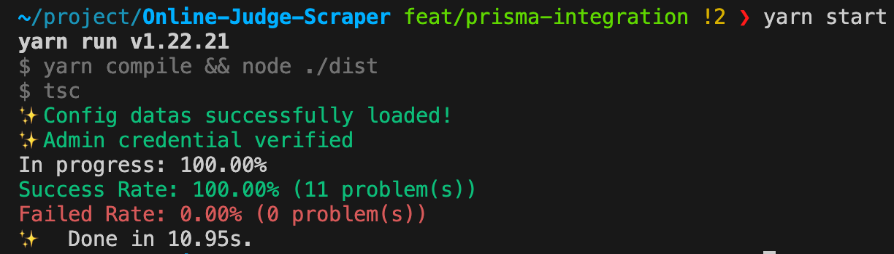

## Online Judge Scraper

Online Web Scraper for [Online Judge System Backend](https://github.com/J-Hoplin/Online-Judge-System). This scraper scrape datas from [Baekjoon Online Judge](https://www.acmicpc.net/)

---

### Used Skills

- TypeScript(v5.3)
- [Puppeteer](https://pptr.dev/)
- [Prisma ORM](https://www.prisma.io/)

### Be aware these

**Be aware that you need to start [`Online Judge System`](https://github.com/J-Hoplin/Online-Judge-System)'s Database to be initialized.**

The `DATABASE_URL` in the .env file must be the same with `DATABASE_URL` of `Online Judge System`.

Set configuration datas through `.env` file.

```
BOJ_ROOT="https://www.acmicpc.net/problem"
CHUNK="3"
RANGE_START="1000" // Should be greater and equal than 1000
RANGE_END="1100" // should be less or equal than 31000
```

If validation failed, it will return an error.

```
❌Fail to load config datas
🔧RANGE_START: RANGE_START must not be less than 1000
🔧RANGE_END: RANGE_END must not be greater than 31000
```

**In this project, I set puppeteer cache directory to project directory to prevent chronium cache collision with other puppeteer application. If you don't want this, remove `.puppeteerrc.js` and reinstall puppeteer.**

### Add repository

For future update plan of `Online Judge System`, use pre-defined repository pattern if you need to change another database management system. Below are the example skeleton code of adding PostgreSQL Repository. **Repository should be defined in `src/database/repository`(this is just convention of the project)**.

```typescript
import { PrismaConnector } from '../connector';
import { IRepository } from './repository.interface';

export class PostgreSQLRepository extends PrismaConnector implements IRepository{
    consturctor(){
      super();
    }
    async saveProblem(
        title: string,
        problemHTML: string,
        inputHTML: string,
        outputHTML: string,
        timeLimit: number,
        memoryLimit: number
        examples:string[][]
    ): Promise<void> {
        // Implement your repository
    }
}
```

### How to use?

1. Install dependencies

   ```
   yarn install
   ```

2. Generate prisma client

   ```
   yarn generate
   ```

3. Modify `.env` in accordance with your preference

4. Start scraper

   ```
   yarn start
   ```


